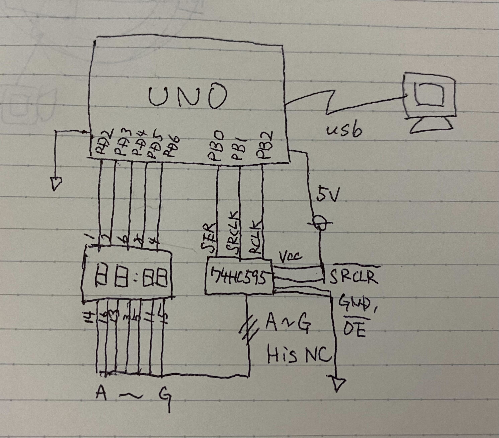

..  Copyright 2014-present PlatformIO <contact@platformio.org>
    Licensed under the Apache License, Version 2.0 (the "License");
    you may not use this file except in compliance with the License.
    You may obtain a copy of the License at
       http://www.apache.org/licenses/LICENSE-2.0
    Unless required by applicable law or agreed to in writing, software
    distributed under the License is distributed on an "AS IS" BASIS,
    WITHOUT WARRANTIES OR CONDITIONS OF ANY KIND, either express or implied.
    See the License for the specific language governing permissions and
    limitations under the License.

Arduino Uno 7seg digital clock by pure c language example
=====================================

what this project aims to?
========

* no uses arduino language, use just pure c, then I'm feel like a /macho/ person
* no uses fancy libraries
* do by your bare-hands!
* then I can learn what's happened down the in the MIKROCOMPUTERS!

miscs
--------

however, this project uses arduino bootloader (I think it's still there), and avr-gcc libraries.

yeah, NIH syndrome<https://en.wikipedia.org/wiki/Not_invented_here> is a bad thing mate! follow the UNIX philosophy.

this is just a my hobby project and not intended for actual use anyway.

Design and stuff
========

what's the ingredients?  
--------

* Arduino Uno (ofcource compatible from China one)
* 4 digit 7 segment LED, OSL40391-IG <https://akizukidenshi.com/download/ds/optosupply/OSL40391-XX.PDF>
* 74HC595
* Resistance 2k oam x 5 (not armed one)

circuit design
--------

known issue
========

* time is not accurate (ouch!)

Who's auther?
========

Matsu
twitter @pineshrine<https://twitter.com/pineshrine>

original document follows below:

How to build PlatformIO based project
=====================================

1. `Install PlatformIO Core <http://docs.platformio.org/page/core.html>`_
2. Download `development platform with examples <https://github.com/platformio/platform-atmelavr/archive/develop.zip>`_
3. Extract ZIP archive
4. Run these commands:

.. code-block:: bash

    # Change directory to example
    > cd platform-atmelavr/examples/native-blink

    # Build project
    > platformio run

    # Upload firmware
    > platformio run --target upload

    # Clean build files
    > platformio run --target clean
